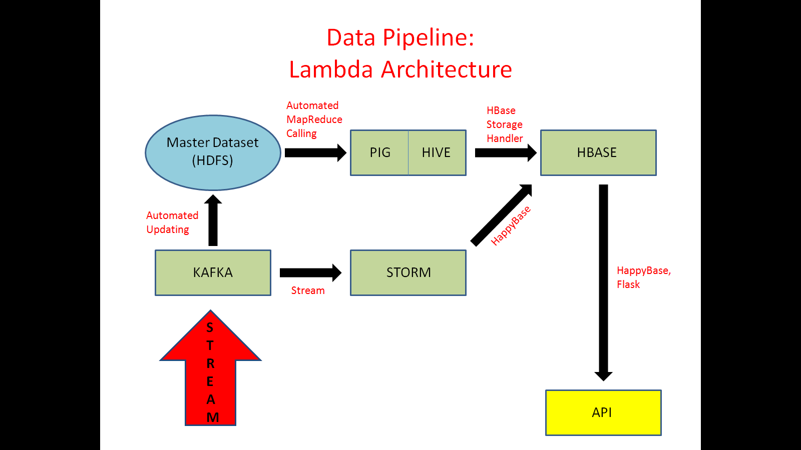

# WikiMaps
TRENDING TOPIC AROUND THE WORLD

I built a data pipeline to easily access and query Wikipedia article traffic data, for all available Wikipedia-languages. My data pipeline follows Lambda-architecture design principles, allowing for high data availability and eventual consistency even in the presence of partitions: 

I use well-known MapReduce frameworks (Pig/Hive) to clean and process raw Wikipedia traffic data (~2.5TB). I use NoSQL tables (HBase) to enable efficient querying of the processed Wikipedia traffic data. I add a real-time pipeline (Kafka/Storm) to handle incoming Wikipedia traffic data streams.

