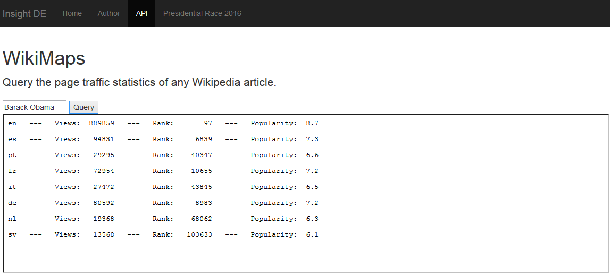

# WikiMaps
TRENDING TOPICS AROUND THE WORLD

I built a data pipeline to easily access and query Wikipedia article traffic data. My API delivers page views, page rank, and popularity index of any Wikipedia topic, for any language in which the topic exists.   

My data pipeline adopts a Lambda-architecture design, allowing for high data availability and eventual consistency in the presence of database partitions: 

I use MapReduce frameworks (Pig, Hive) to clean and process raw Wikipedia traffic data. I use a NoSQL data store (HBase) to efficently serve processed Wikipedia data. I add real-time components (Kafka, Storm) to handle incoming Wikipedia traffic streams, ensuring that the API is always current. 

An examplary API call for the topic "Barack Obama", using monthly granularity and restricting to 8 popular Wikipedia languages, is provided below.

To showcase the real-time features of the data pipeline, I created a second API using the inbounding Wikipedia traffic data stream as a source. This second API monitors the article traffic statistics of potential U.S. Presidential Candidates for the 2016 election season. The API tracks which candidates currently generate the most interest on Wikipedia -- this might provide a useful metric for the impact of electoral campaigns, or for gauging a candidate's overall visibility. 

Note that the API updates every second to ensure utmost currentness of data, allowing to assess the impact of election events as they happen (such as the launch of big campaign ads, or the unfolding of scandals involving presidential candidates). 

To learn more about my INSIGHT project, click on the video below to watch a screencast I compiled about the various elements used in my data pipeline (includes a demo of the API).

